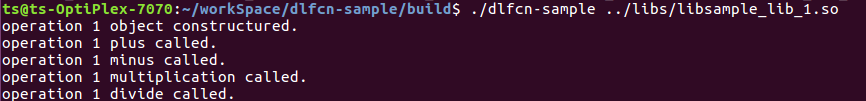
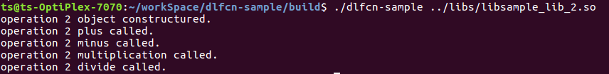

# dlfcn-sample

## Overview

This is a sample code to show you how to explicit call APIs from different dynamic shared library. It develops and tests under Linux Ubuntu 16.04 x86 platform, arm64 also works well. Relative tutorial of `dlfcn` is [here](https://ricardolu.gitbook.io/trantor/load-shared-library-apis-dynamically).

## File

```shell
.
├── CMakeLists.txt				# test program build cmake file
├── DLLoader.h					# api loader abstract class
├── Interface.h					# abstract API for outside calling class member function
├── libs						# test libraries
│   ├── CMakeLists.txt			# test libraries build cmake file
│   ├── Interface_1.cpp			# API implement of libmath_1
│   ├── Interface_2.cpp			# API implement of libmath_2
│   ├── Interface.h				# outside call interface header
│   ├── libmath_1.cpp			# implement of libmath_1
│   ├── libmath_1.h
│   ├── libmath_2.cpp			# # implement of libmath_2
│   ├── libmath_2.h
│   ├── libsample_lib_1.so
│   └── libsample_lib_2.so
├── LICENSE
├── main.cpp
└── README.md
```

## Build

```shell
cmake -H. -Bbuild/
cd build && make
```

## Run

```shell
cd build
./dlfcn-sample ../libs/libsample_lib_1.so
./dlfcn-sample ../libs/libsample_lib_2.so 
```



